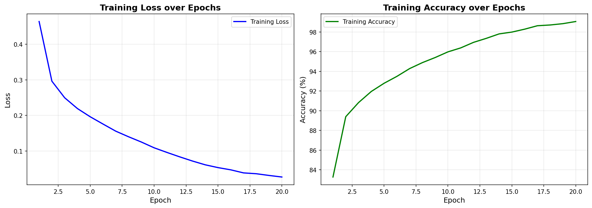
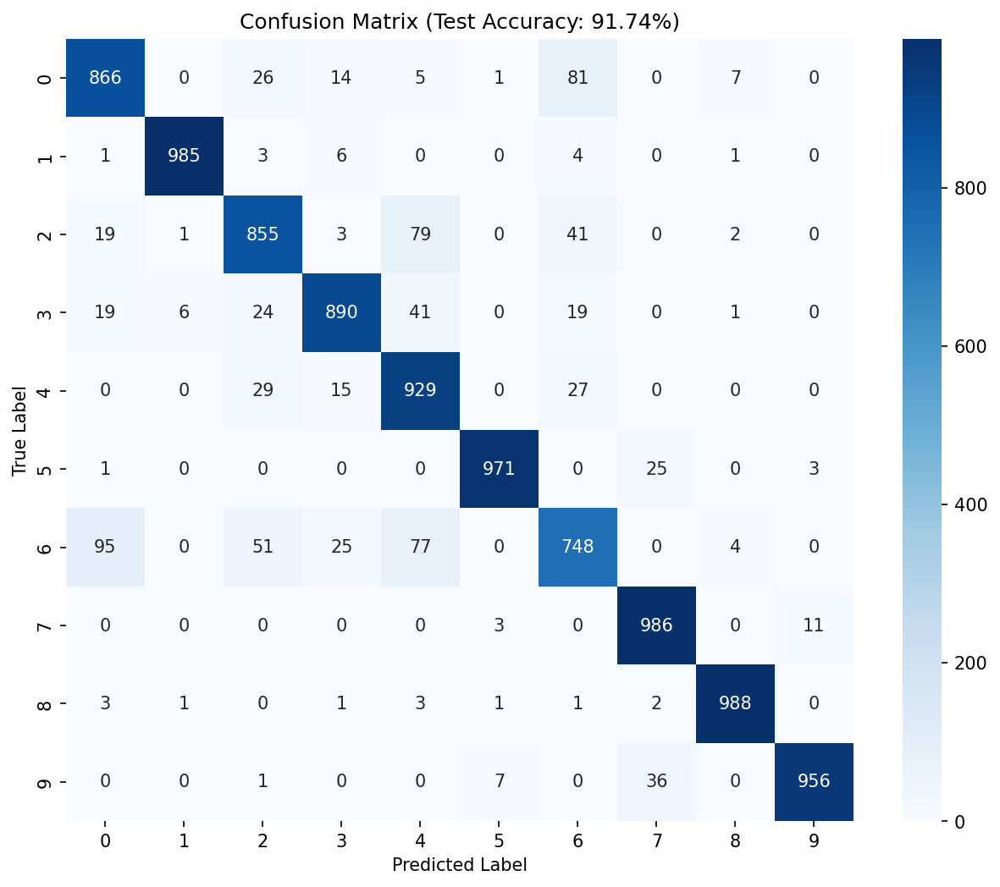

## 한 줄 요약

Fashion-MNIST의 10개 의류 클래스를 대상으로 2개 합성곱 블록으로 구성한 CNN을 구현했습니다. 보존된 실행 산출물에서 테스트 정확도 91.74%를 확인했고, 혼동 행렬을 통해 상의류 클래스가 주요 오분류 구간임을 확인했습니다.

## 프로젝트 개요

| 항목           | 내용                                                                   |
| -------------- | ---------------------------------------------------------------------- |
| 구분           | 개인 학습 프로젝트                                                     |
| 문제 유형      | 다중 클래스 이미지 분류                                                |
| 데이터         | Fashion-MNIST 학습 60,000건, 테스트 10,000건, 28×28 흑백 이미지        |
| 직접 수행 범위 | IDX 형식 데이터 로드, 전처리, CNN 구현, 학습 루프, 테스트 평가, 시각화 |
| 주요 기술      | Python, PyTorch, NumPy, Matplotlib, Apple Silicon MPS                  |
| 상태           | 구현 완료, 기존 실행 산출물 기준 로컬 검증                             |

Fashion-MNIST는 10개 의류 클래스의 28×28 흑백 이미지로 구성된 데이터셋입니다. 이 프로젝트에서는 픽셀의 공간적 관계를 활용하는 합성곱 신경망(CNN)을 직접 구현해 분류 과정을 익히는 데 초점을 두었습니다.

## 문제와 목표

목표는 의류 이미지 한 장을 입력받아 티셔츠, 바지, 풀오버, 드레스 등 10개 클래스 중 하나로 분류하는 모델을 만드는 것이었습니다.

단순히 최종 정확도만 확인하지 않고, 다음 질문에 답하는 것을 목표로 삼았습니다.

- 이미지 텐서를 PyTorch 입력 형식으로 어떻게 변환하는가?
- 합성곱과 풀링이 이미지 특징을 어떻게 단계적으로 축약하는가?
- 어떤 클래스 쌍에서 오분류가 집중되는가?

## 데이터 처리

원본 IDX 바이너리 파일을 NumPy로 직접 읽었습니다. 이미지 파일은 16바이트, 레이블 파일은 8바이트 헤더를 건너뛴 뒤 배열로 변환했습니다.

입력 데이터는 다음 순서로 처리했습니다.

1. 픽셀 값을 `0~255` 정수에서 `0~1` 범위의 `float32`로 정규화했습니다.
2. 이미지 배열을 `(N, 28, 28)`에서 `(N, 1, 28, 28)`으로 변환했습니다.
3. 학습 데이터는 배치 크기 64로 구성하고, 매 epoch마다 순서를 섞었습니다.

두 번째 차원인 채널(channel)을 추가한 이유는 `Conv2d`가 배치·채널·높이·너비(NCHW) 순서의 입력을 받기 때문입니다.

## 모델 설계

모델은 두 개의 합성곱 블록과 두 개의 완전연결층으로 구성했습니다.

```text
입력: (1, 28, 28)
Conv2d(1, 32, kernel=3, padding=1) + ReLU + MaxPool2d(2)
  (32, 14, 14)
Conv2d(32, 64, kernel=3, padding=1) + ReLU + MaxPool2d(2)
  (64, 7, 7)
Flatten
Linear(3136, 128) + ReLU
Linear(128, 10)
```

3×3 합성곱으로 지역적 형태를 추출하고, 풀링으로 공간 크기를 절반씩 줄였습니다. 두 번째 풀링 뒤의 특징 맵은 `64 × 7 × 7`이므로, 완전연결층 입력 크기는 3,136입니다.

학습에는 Adam 옵티마이저를 사용했고, 학습률은 `0.0008`, epoch 수는 20으로 설정했습니다. 실행 환경에서 MPS 장치를 사용한 기록이 남아 있습니다.

## 검증 결과

보존된 노트북 출력과 혼동 행렬에 표시된 테스트 정확도는 **91.74%**입니다.



학습 정확도는 마지막 epoch에서 99.06%까지 상승했습니다. 반면 테스트 정확도는 91.74%이므로, 학습 데이터에 더 강하게 맞춰졌을 가능성을 함께 살펴볼 필요가 있습니다. 검증 집합의 epoch별 지표는 저장돼 있지 않아, 과적합 여부를 확정할 수는 없습니다.

| 검증 항목      | 근거               | 결과                                  | 상태      |
| -------------- | ------------------ | ------------------------------------- | --------- |
| 모델 구조      | 노트북의 모델 출력 | 2개 합성곱 블록과 2개 완전연결층 확인 | 통과      |
| 테스트 평가    | 노트북 실행 출력   | 정확도 91.74%                         | 통과      |
| 클래스별 오류  | 저장된 혼동 행렬   | 상의류 중심의 오분류 패턴 확인        | 통과      |
| 현 환경 재실행 | 데이터 파일 미포함 | 미실행                                | 확인 필요 |

이 글의 수치는 기존 실행 산출물에 근거합니다. 현재 저장소의 자료에는 원본 데이터 파일과 실행 환경 정의가 포함돼 있지 않아, 작성 시점의 Windows 환경에서는 재실행하지 못했습니다.

## 오분류 분석



혼동 행렬에서 가장 눈에 띄는 오류는 상의류 클래스입니다.

- 실제 `Shirt`(6)는 `T-shirt/top`(0), `Pullover`(2), `Coat`(4)로 자주 분류됐습니다.
- 실제 `T-shirt/top`(0)도 `Shirt`(6)로 81건 오분류됐습니다.
- `Trouser`(1), `Bag`(8), `Sneaker`(7)처럼 형태가 비교적 뚜렷한 클래스는 높은 정분류 수를 보였습니다.

이 결과는 28×28 흑백 이미지에서 비슷한 실루엣의 상의류를 구분하기 어렵다는 점을 보여줍니다. 색상·질감·세부 형태 정보가 없는 데이터 특성도 영향을 줬을 가능성이 있습니다.

## 한계와 후속 과제

현재 모델은 학습 곡선과 최종 테스트 정확도만 보존돼 있습니다. 다음 개선은 아직 계획이며, 구현·검증 결과가 아닙니다.

- 학습·검증 데이터를 분리하고 epoch별 검증 손실과 정확도를 기록합니다.
- Dropout과 Batch Normalization을 추가해 과적합을 완화합니다.
- 회전, 이동 등 데이터 증강을 적용해 상의류 분류 성능 변화를 비교합니다.
- 단순 다층 퍼셉트론(MLP) 기준선과 CNN을 같은 조건에서 비교합니다.
- 데이터 경로와 의존성을 프로젝트 상대 경로와 환경 파일로 정리해 재현성을 확보합니다.

## 배운 점

- 이미지 분류에서는 텐서 형태와 채널 축이 모델 입력 계약의 일부입니다.
- 합성곱·풀링의 출력 크기를 계산해야 완전연결층 입력 크기를 정확히 연결할 수 있습니다.
- 전체 정확도만으로는 부족하며, 혼동 행렬을 함께 봐야 모델의 약점을 구체적으로 확인할 수 있습니다.
- 저장된 실행 결과는 근거가 되지만, 데이터와 환경이 없으면 같은 결과를 다시 검증할 수 없습니다.

## 참고 자료

- [Fashion-MNIST 공식 저장소](https://github.com/zalandoresearch/fashion-mnist)
- [PyTorch Conv2d 문서](https://docs.pytorch.org/docs/stable/generated/torch.nn.Conv2d.html)
- [PyTorch 데이터 로딩 문서](https://docs.pytorch.org/docs/stable/data.html)
